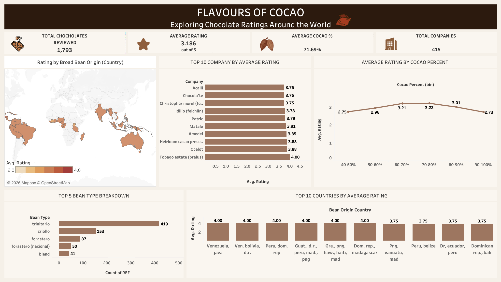

# Cacao Analysis 

## Project Overview
Analysis of global cacao and chocolate rating data using SQL and Tableau to uncover top performing companies, bean origins, cocoa percentage trends and chocolate ratings worldwide.

## Objective
To analyze chocolate ratings across companies and regions, identify top performing bean origins, and explore how cocoa percentage affects chocolate quality ratings.

## Dataset Information
- Source: Global Chocolate Rating Dataset
- Size: 1,793 chocolate reviews
- Fields: Company, bean origin, cocoa percentage, rating, bean type and review date

## Tools Used
- MySQL — Data cleaning & Exploratory Data Analysis (EDA)
- Tableau — Interactive dashboard & data visualization

## Business Questions
- Which companies have the highest average chocolate ratings?
- Which bean origin countries produce the best rated cacao?
- How does cocoa percentage affect chocolate ratings?
- Which bean types are most commonly used?
- What is the average cocoa percentage across all chocolates?

## Data Cleaning Process
- Corrected data types
- Handled missing values
- Standardized cocoa percentage fields
- Cleaned and grouped bean origin countries
- Removed duplicates and irrelevant columns

## EDA Process
- Analyzed top 10 companies by average rating
- Mapped bean origin countries by rating
- Examined relationship between cocoa percentage and rating
- Identified top 5 bean types by frequency
- Analyzed average ratings by cocoa percentage bins

## Key Insights
- Tobago Estate (Pralus) is the highest rated company with a 4.0 average rating
- Venezuela, Peru and Dominican Republic are among the top rated bean origin countries
- Chocolates with 70-80% cocoa percentage yield the highest average rating of 3.22
- Ratings decline as cocoa percentage increases beyond 80%
- Trinitario is the most commonly used bean type

## Recommendations
- Chocolate manufacturers should target 70-80% cocoa percentage for optimal ratings
- Source beans from Venezuela and Peru for higher quality output
- Companies with ratings below 3.0 should review their bean sourcing and production process

## Limitations
Some bean origin entries contained multiple countries combined, which were kept as is to preserve the original data structure.

## Files
- cacao_analysis.sql — Data cleaning and Exploratory Data Analysis

## Dashboard Preview

## Dashboard
🔗 [View Interactive Dashboard on Tableau Public](https://public.tableau.com/app/profile/laurina.salami/viz/COCOA-ANALYSISDASHBOARD/Dashboard1)
